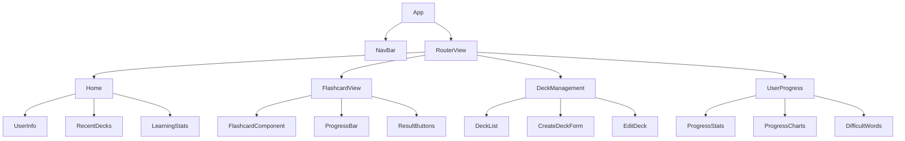
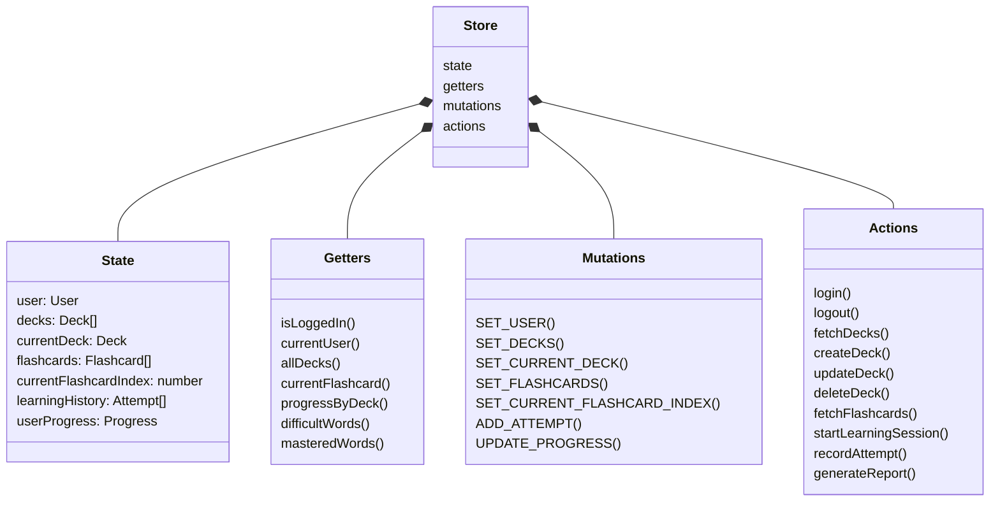
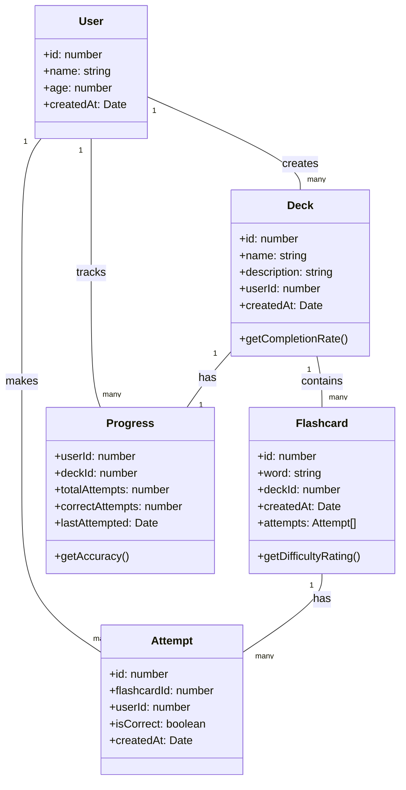
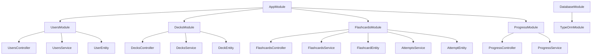
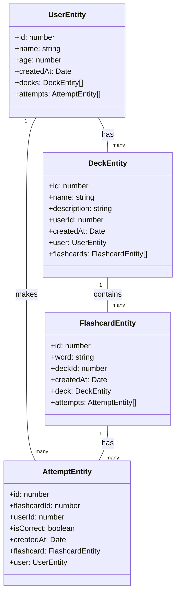
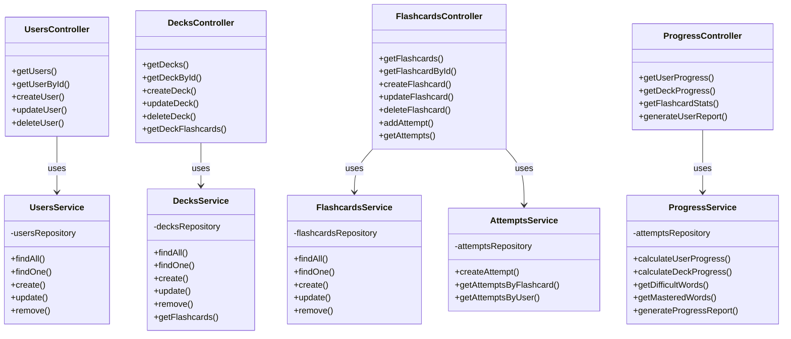
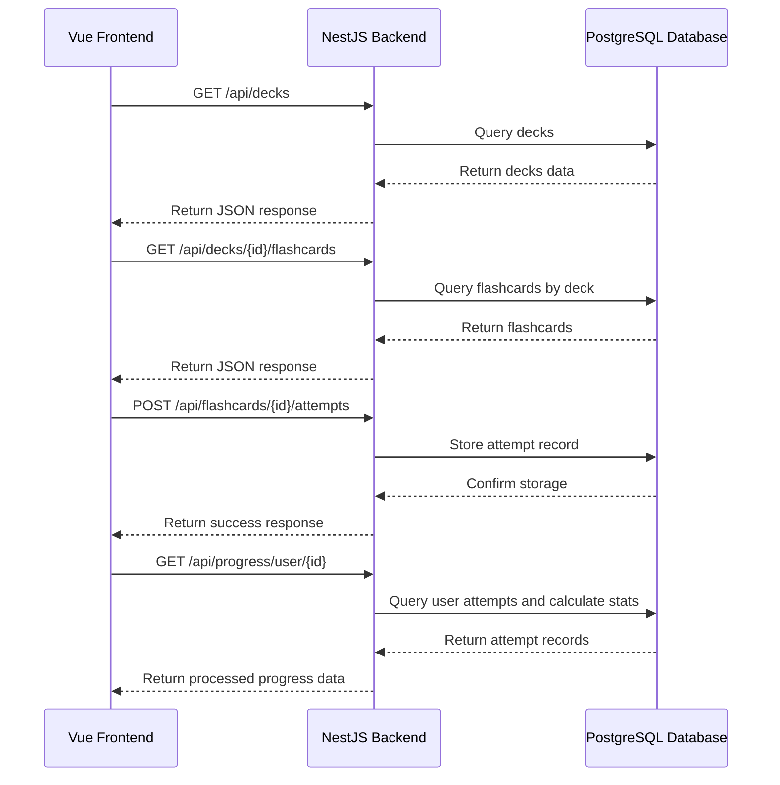
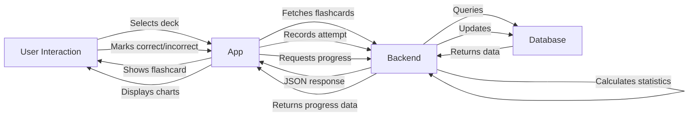

# Flashcard Learning App Architecture Diagrams

This document outlines the architecture of the Flashcard Learning application, including UML diagrams for both frontend and backend components.

## Frontend Architecture (Vue.js)

### Component Hierarchy

### Vuex Store Structure

### Frontend Data Models

## Backend Architecture (NestJS)

### Module Structure

### Backend Entities

### Services and Controllers

## API Flow Diagram

## Data Flow Diagram

This architecture provides a complete view of the Flashcard Learning application's components, their relationships, and data flow, ensuring a maintainable and scalable system.
