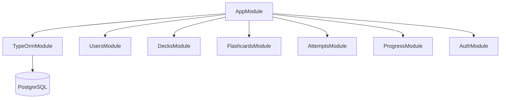
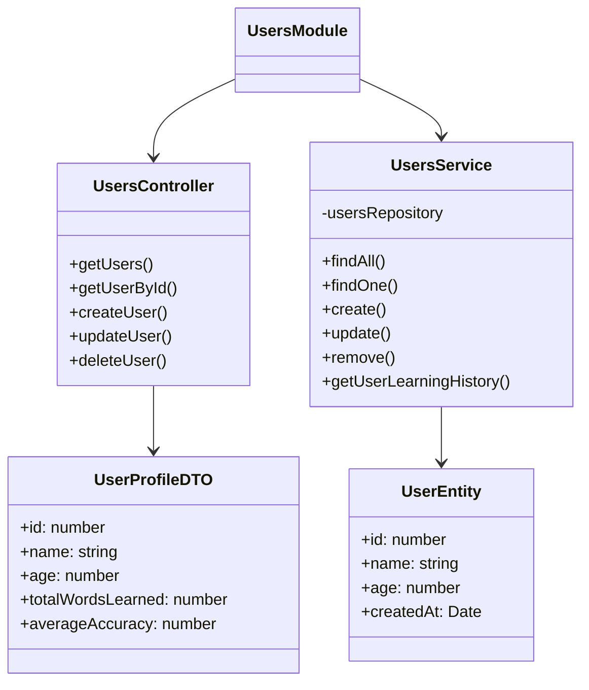
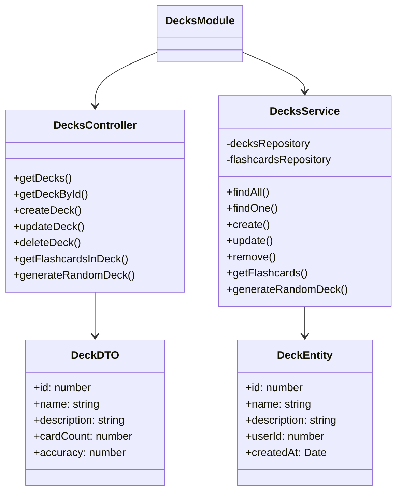
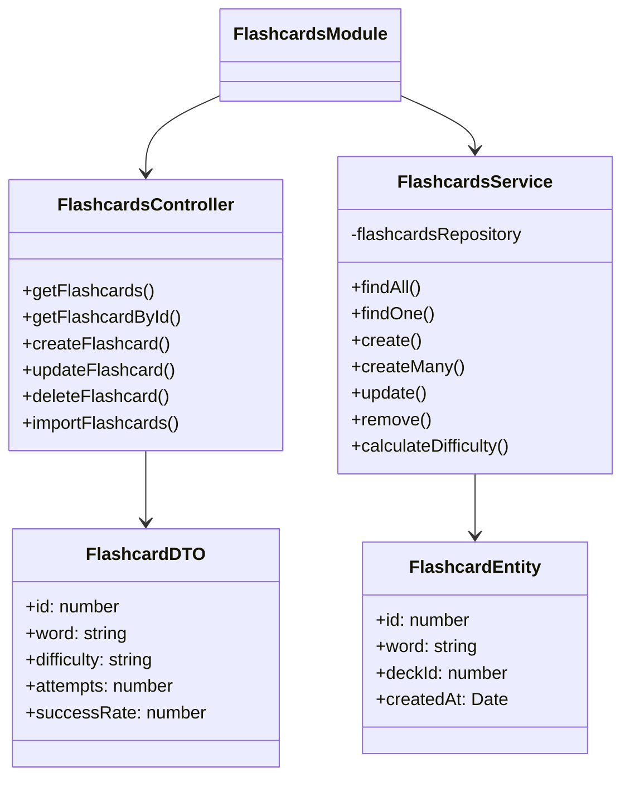
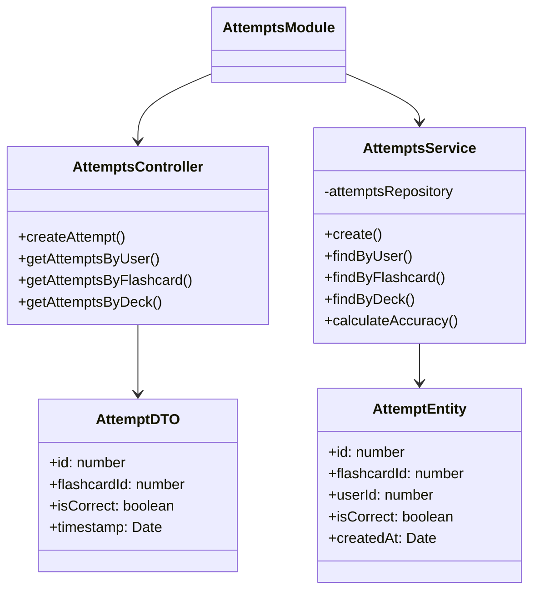
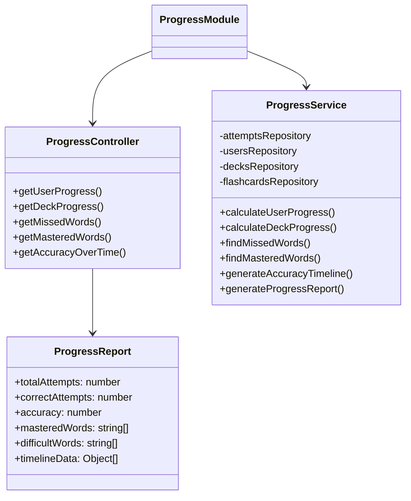
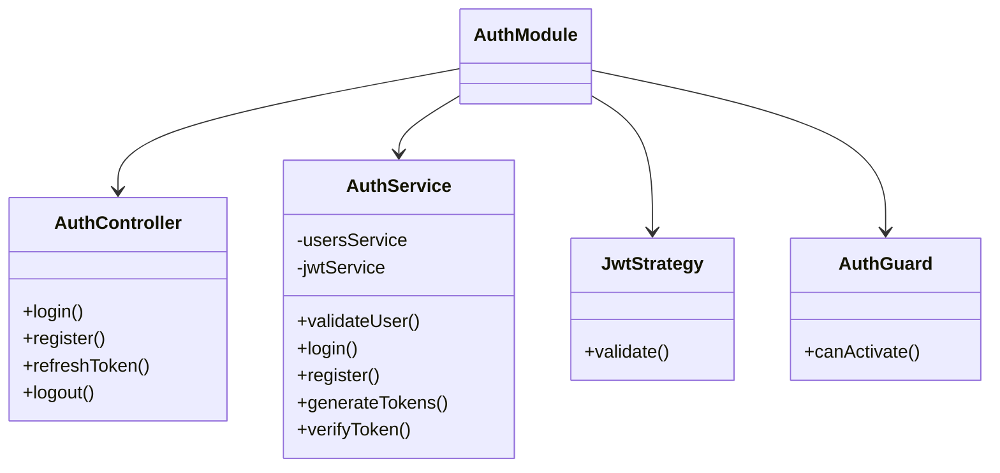
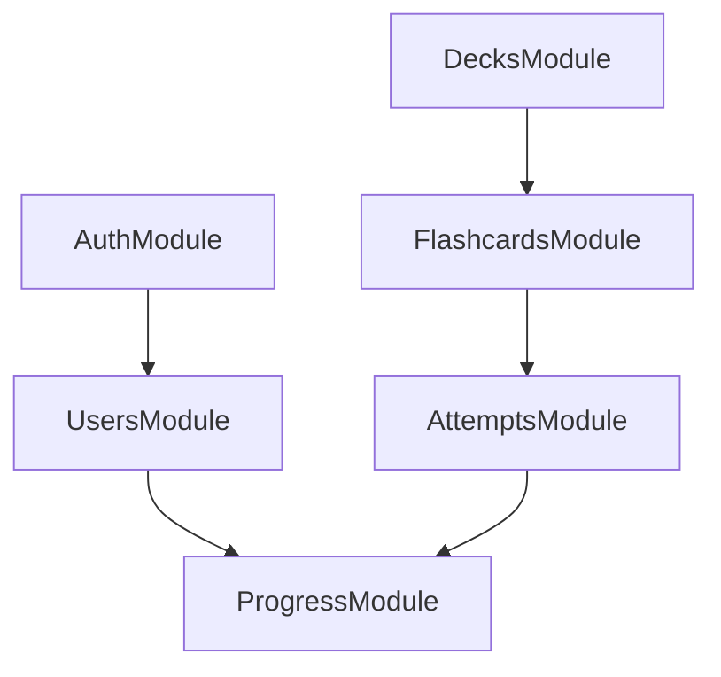
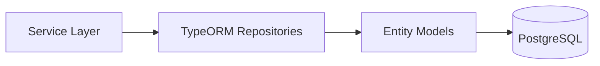

# Flashcard Learning App Backend Modules

This document outlines the key modules of the NestJS backend for the Flashcard Learning application.

## Backend Architecture Overview

The backend follows a modular architecture using NestJS framework with TypeORM for database interactions.

## Module Definitions

### 1. Users Module

Responsible for user management operations.

**Responsibilities:**
- User profile creation and management
- User preferences storage
- User authentication (optional)

**Endpoints:**
- `GET /api/users` - List all users
- `GET /api/users/:id` - Get specific user
- `POST /api/users` - Create new user
- `PUT /api/users/:id` - Update user
- `DELETE /api/users/:id` - Delete user

### 2. Decks Module

Handles the organization of flashcards into logical collections.

**Responsibilities:**
- Create and manage decks of flashcards
- Generate random decks based on user parameters
- Associate decks with users

**Endpoints:**
- `GET /api/decks` - List all decks
- `GET /api/decks/:id` - Get specific deck
- `GET /api/decks/:id/flashcards` - Get flashcards in deck
- `POST /api/decks` - Create new deck
- `PUT /api/decks/:id` - Update deck
- `DELETE /api/decks/:id` - Delete deck
- `POST /api/decks/random` - Generate random deck

### 3. Flashcards Module

Manages individual flashcards and their content.

**Responsibilities:**
- Create and manage flashcards
- Import flashcards from predefined lists
- Calculate difficulty level of flashcards

**Endpoints:**
- `GET /api/flashcards` - List all flashcards
- `GET /api/flashcards/:id` - Get specific flashcard
- `POST /api/flashcards` - Create new flashcard
- `PUT /api/flashcards/:id` - Update flashcard
- `DELETE /api/flashcards/:id` - Delete flashcard
- `POST /api/flashcards/import` - Import flashcards from list

### 4. Attempts Module

Tracks learning history for flashcards.

**Responsibilities:**
- Record user attempts at flashcards
- Track correct/incorrect responses
- Provide history of learning attempts

**Endpoints:**
- `POST /api/attempts` - Create new attempt
- `GET /api/attempts/user/:userId` - Get attempts by user
- `GET /api/attempts/flashcard/:flashcardId` - Get attempts by flashcard
- `GET /api/attempts/deck/:deckId` - Get attempts by deck

### 5. Progress Module

Handles analysis and reporting of user progress.

**Responsibilities:**
- Generate progress reports and statistics
- Calculate user accuracy and mastery levels
- Identify difficult words requiring more practice
- Create visualization data for charts

**Endpoints:**
- `GET /api/progress/user/:userId` - Get user progress overview
- `GET /api/progress/deck/:deckId` - Get progress for specific deck
- `GET /api/progress/user/:userId/missed` - Get frequently missed words
- `GET /api/progress/user/:userId/mastered` - Get mastered words
- `GET /api/progress/user/:userId/timeline` - Get accuracy over time

### 6. Auth Module (Optional)

Handles user authentication and authorization if needed.

**Responsibilities:**
- User authentication (login/register)
- Token generation and verification
- Role-based access control

**Endpoints:**
- `POST /api/auth/login` - Authenticate user
- `POST /api/auth/register` - Register new user
- `POST /api/auth/refresh` - Refresh access token
- `POST /api/auth/logout` - Logout user

## Cross-Module Interactions

## Database Interaction Layer

All modules interact with the database through TypeORM repositories:

This modular architecture ensures:
1. Clear separation of concerns
2. Maintainable, testable code
3. Scalability for future features
4. Flexible deployment options
