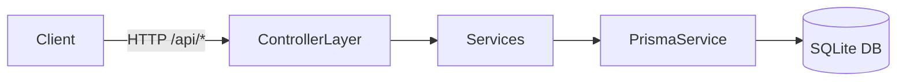
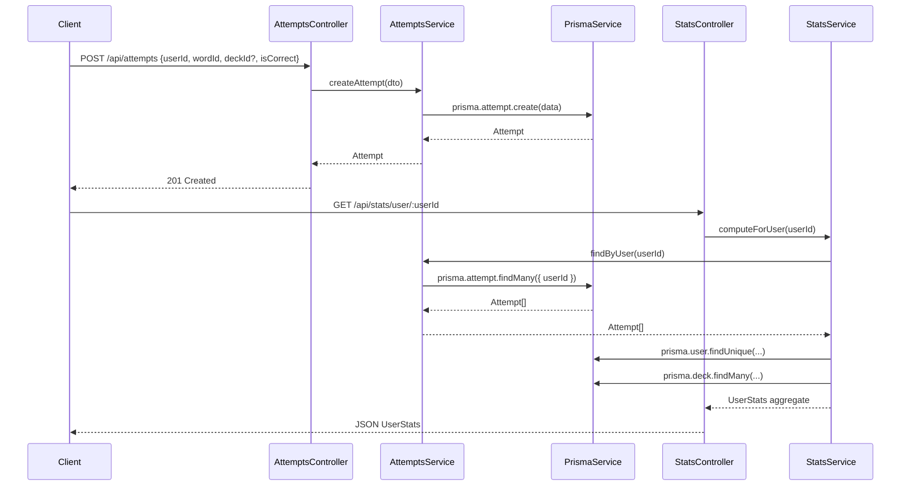

# Backend Architecture

## Overview

The backend is a NestJS application providing REST APIs for users, words, decks, attempts, and statistics. Persistence is handled via Prisma ORM targeting a SQLite database (dev). The design uses feature modules with clear separation of concerns.

## Module Structure

```text
AppModule
  ├─ PrismaModule (PrismaService)
  ├─ UsersModule (UsersController, UsersService)
  ├─ WordsModule (WordsController, WordsService)
  ├─ DecksModule (DecksController, DecksService)
  ├─ AttemptsModule (AttemptsController, AttemptsService)
  └─ StatsModule (StatsController, StatsService)
```

## High-Level Component Diagram (Mermaid)



## Request Flow (Sequence Diagram)

Example: Recording an attempt then computing stats.



## Prisma Data Model (Class Diagram)

```mermaid
classDiagram
  class User {
    String id
    String name
    Int age
    DateTime createdAt
  }
  class Word {
    String id
    String text (unique)
    String difficulty
    DateTime createdAt
  }
  class Deck {
    String id
    String name
    Boolean generated
    DateTime createdAt
    String userId
  }
  class DeckWord {
    String deckId
    String wordId
    (composite key)
  }
  class Attempt {
    String id
    String userId
    String wordId
    String deckId?
    Boolean isCorrect
    DateTime timestamp
  }
  User --> Attempt : attempts
  User --> Deck : decks
  Word --> Attempt : attempts
  Deck --> Attempt : attempts
  Deck --o DeckWord : words
  Word --o DeckWord : decks
```

## Stats Logic Overview

Longest consecutive correct streak per word is used to classify learned words (>= 3). Words needing revision have more incorrect than correct attempts. Most missed words have >= 3 incorrect attempts.

## Error Handling & Edge Cases

- Empty dataset: Stats endpoints return zeros and empty arrays.
- Concurrency: SQLite single-writer; NestJS services rely on Prisma internal queue.
- Missing user: Stats still compute from attempts; user metadata optional.

## Performance Considerations

- Aggregations currently executed in memory after fetching all attempts for a user. For large datasets, add Prisma aggregations or introduce materialized stats table.

## Future Enhancements

- Introduce caching layer for stats.
- Migrate to Postgres for production scaling.
- Add authentication module (JWT) and authorization guards.
- Add pagination to list endpoints.

## Deployment Notes

- Ensure `DATABASE_URL` is set. For SQLite dev: `file:./dev.db`.
- Run migrations: `npx prisma migrate deploy` in container.
- Seed data: `ts-node prisma/seed.ts`.
