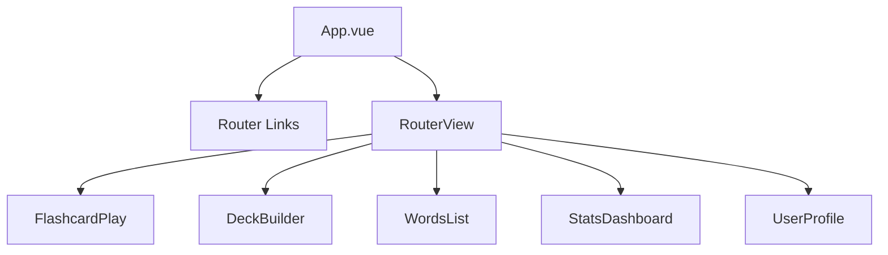
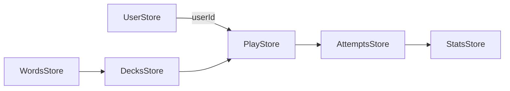
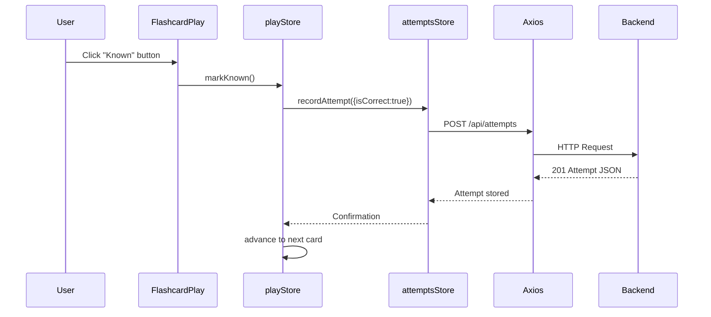
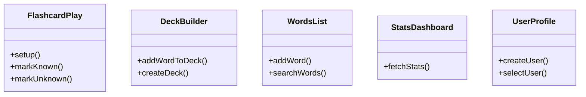

# Frontend Architecture

## Overview

The frontend is a Vue 3 Single Page Application using Vite for bundling, Pinia for state management, Vue Router for navigation, and Axios for HTTP calls to the NestJS backend.

## Component Hierarchy



## Routing Table

```text
/play      -> FlashcardPlay.vue
/decks     -> DeckBuilder.vue
/words     -> WordsList.vue
/stats     -> StatsDashboard.vue
/user      -> UserProfile.vue
```

## State Management (Pinia Stores)



### Stores Summary

- userStore: current user selection/create.
- wordsStore: CRUD operations for words.
- decksStore: create/generate decks; maps deck relations.
- attemptsStore: record attempts; fetch per-user attempts.
- statsStore: fetch aggregated stats from backend.
- playStore: orchestrates flashcard sequence (current deck, index, marking correctness).

## Data Flow (Attempt Recording) Sequence



## Component Interaction (Mermaid)



## UI/UX Considerations

- Keyboard shortcuts for faster play.
- Active route highlighting via `router-link-active` class.
- Simple responsive layout (flex-based header).

## Performance

- Lightweight: only fetch attempts & stats on demand.
- Potential optimization: cache stats in store until invalidated by new attempt.

## Error Handling

- Minimal currently; future: global Axios interceptor for API errors.
- Edge cases: empty decks; no user selected.

## Future Enhancements

- Charting (accuracy trends) with Chart.js.
- Localization/i18n.
- Service worker for offline practice.
- Accessibility improvements.

## Build & Deployment

- `npm run build` produces `dist/` served by Nginx in Docker image.
- Routing uses HTML5 history; Nginx config includes SPA fallback.
